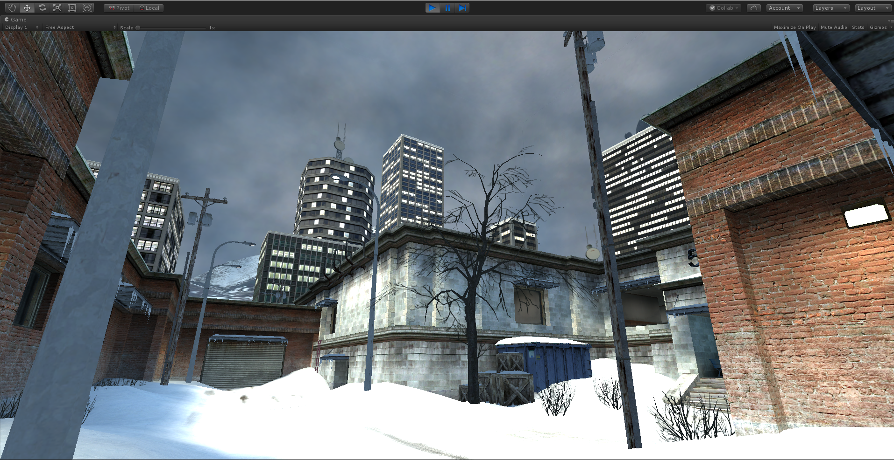

# uSource
uSource is a plugin for importing MDL / BSP / VMT / VTF and etc... resources to Unity!

# Supported formats (1.1 Beta):

## Source
| Format | Type of content                    | Import             | Export to Unity    |
| ------ | ------                             | ------             | ------             |
| .MDL   | Studio Models                      | :heavy_check_mark: | :x:                |
| .VCD   | Choreography Scenes (scenes.image) | In the future      | :x:                |
| .BSP   | Map Files (Compiled)               | :heavy_check_mark: | :x:                |
| .VMF   | Map Files (Hammer format)          | In the future      | :x:                |
| .VPK   | Valve Packages                     | :heavy_check_mark: | :x:                |
| .GCF   | Grid Cache Files                   | In the future      | :x:                |
| .NCF   | No Cache Files                     | In the future      | :x:                |
| .DMX   | Datamodels                         | :x:                | :x:                |
| .PCF   | Particles                          | :x:                | :x:                |
| .DMX   | SFM Sessions                       | :x:                | :x:                |
| .VTF   | Textures                           | :heavy_check_mark: | :heavy_check_mark: |
| .VMT   | Materials                          | :heavy_check_mark: | :heavy_check_mark: |

## GoldSource
| Format            | Type of content   | Import            | Export to Unity   |
| ------            | ------            | ------            | ------            |
| NOT SUPPORTED YET | NOT SUPPORTED YET | NOT SUPPORTED YET | NOT SUPPORTED YET |

## Source 2
| Format            | Type of content   | Import            | Export to Unity   |
| ------            | ------            | ------            | ------            |
| NOT SUPPORTED YET | NOT SUPPORTED YET | NOT SUPPORTED YET | NOT SUPPORTED YET |

# Supported features (1.1 Beta):

## Studio Models (MDL / VVD / VTX / PHY / ANI / VHV)
| Feature                        | Supported                                                             |
| ------                         | ------                                                                |
| Versions                       | 44 - 49 (Some older versions can load too, but possible errors!)      |
| Bones                          | :heavy_check_mark:                                                    |
| Hitboxes                       | :heavy_check_mark:                                                    |
| Animations / Sequences         | (Partial)                                                             |
| Procedural Bones               | :x:                                                                   |
| Materials                      | :heavy_check_mark:                                                    |
| Skinfamilies                   | :x:                                                                   |
| Attachments                    | :x:                                                                   |
| Flexes / Vertex Animations     | :x:                                                                   |
| Meshes (With skinning)         | :heavy_check_mark: (Lod's or some 49's mdl may not have some meshes!) |
| Physics Model                  | :x:                                                                   |
| Vertex Lighting (Static props) | :x:                                                                   |

## BSP / Map Files
| Feature                           | Supported                                             |
| ------                            | ------                                                |
| Versions                          | 19 (possible errors!), 20, 21                         |
| PAK                               | :heavy_check_mark:                                    |
| LZMA Lumps                        | :x: (TF2 Updated maps)                                |
| Models                            | :heavy_check_mark:                                    |
| Physics                           | (Not a stable implementation, the code is "disabled") |
| Displacements                     | (Partial, neighbor disps not supported yet)           |
| Visibility                        | :x:                                                   |
| Occlusion                         | :x:                                                   |
| Entities                          | :heavy_check_mark:                                    |
| Static / Dynamic Props            | :heavy_check_mark:                                    |
| WorldLights                       | :heavy_check_mark:                                    |
| Decals                            | (Partial, overlays still not supported)               |
| Cubemaps                          | :x:                                                   |
| Lightmaps                         | (Partial, light style not supported yet)              |
| Ambient cubes                     | :x:                                                   |

## Textures
| Feature            | Supported              |
| ------             | ------                 |
| Versions           | 7.1 - 7.5 (Maybe 7.0?) |
| Envmaps (Cubemaps) | :heavy_check_mark:     |
| Convert to BGRA32  | :heavy_check_mark:     |

| Texture Formats   | Supported          |
| ------            | ------             |
| RGBA8888          | :heavy_check_mark: |
| ABGR8888          | :heavy_check_mark: |
| RGB888            | :heavy_check_mark: |
| BGR888            | :heavy_check_mark: |
| RGB565            | :heavy_check_mark: |
| I8                | :heavy_check_mark: |
| IA88              | :heavy_check_mark: |
| P8                | :heavy_check_mark: |
| A8                | :heavy_check_mark: |
| RGB888_BLUESCREEN | :heavy_check_mark: |
| BGR888_BLUESCREEN | :heavy_check_mark: |
| DXT1              | :heavy_check_mark: |
| DXT3              | :heavy_check_mark: |
| DXT5              | :heavy_check_mark: |
| BGR565            | :heavy_check_mark: |
| BGRX5551          | :heavy_check_mark: |
| BGRA4444          | :heavy_check_mark: |
| DXT1_ONEBITALPHA  | :heavy_check_mark: |
| UV88              | :heavy_check_mark: |
| UVWQ8888          | :heavy_check_mark: |
| RGBA16161616F     | :heavy_check_mark: |
| RGBA16161616      | :heavy_check_mark: |
| R32F              | :heavy_check_mark: |
| RGB323232F        | :heavy_check_mark: |
| RGBA32323232F     | :heavy_check_mark: |
| NV_DST16          | (Not Tested)       |
| NV_DST24          | (Not Tested)       |
| NV_INTZ           | (Not Tested)       |
| NV_RAWZ           | (Not Tested)       |
| ATI_DST16         | (Not Tested)       |
| ATI_DST24         | (Not Tested)       |
| NV_NULL           | (Not Tested)       |
| ATI_2N            | (Not Tested)       |
| ATI_1N            | (Not Tested)       |

## Materials (In Progress rework!)
| Shaders               | Supported               |
| ------                | ------                  |
| LightmappedGeneric    | (Use Default / Generic) |
| LightmappedReflective | (Use Default / Generic) |
| LightmappedTwoTexture | (Use Default / Generic) |
| Lightmapped_4WayBlend | (Use Default / Generic) |
| Multiblend            | (Use Default / Generic) |
| WorldTwoTextureBlend  | :heavy_check_mark:      |
| WorldVertexTransition | (Partial)               |
| WindowImposter        | (Use Default)           |
| Water                 | (Use Default)           |
| UnlitGeneric          | (Partial)               |
| UnlitTwoTexture       | (Use Default / Generic) |
| WorldGGX              | (Use Default / Generic) |
| ParallaxTest          | (Use Default / Generic) |
| Sky                   | :heavy_check_mark:      |
| Core                  | (Use Default)           |
| SpriteCard            | (Use Default)           |
| Cable                 | (Use Default)           |
| SplineRope            | (Use Default)           |
| Refract               | (Use Default)           |
| MonitorScreen         | (Use Default)           |
| Modulate              | (Use Default)           |
| VertexLitGeneric      | (Use Default / Generic) |
| Eyes                  | (Use Default)           |
| EyeRefract            | (Use Default)           |
| VortWarp              | (Use Default)           |
| Aftershock            | (Use Default)           |
| Teeth                 | (Use Default)           |
| SurfaceGGX            | (Use Default)           |
| Character             | (Use Default / Generic) |
| SolidEnergy           | (Use Default)           |
| VolumeCloud           | (Use Default)           |
| DecalModulate         | (Use Default)           |
| Shadow                | (Use Default)           |
| Subrect               | (Use Default)           |

## VPK
| Feature   | Supported          |
| ------    | ------             |
| Version 1 | :heavy_check_mark: |
| Version 2 | :heavy_check_mark: |

## Datamodels (DMX)
| Feature           | Supported         |
| ------            | ------            |
| NOT SUPPORTED YET | NOT SUPPORTED YET |

## Particles (PCF)
| Feature           | Supported         |
| ------            | ------            |
| NOT SUPPORTED YET | NOT SUPPORTED YET |

## SFM Sessions (DMX)
| Feature           | Supported         |
| ------            | ------            |
| NOT SUPPORTED YET | NOT SUPPORTED YET |
